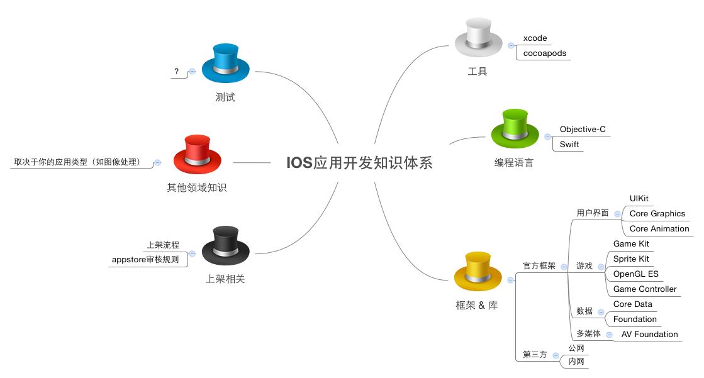

ios-dev-resources
=================

> 说明：IOS 开发知识及资源沉淀。

 

### 一. IOS应用开发知识体系

 

### 二. 常用工具
***

* xcode
	* [Instruments使用教程](http://blog.csdn.net/toss156/article/details/7579294)

* [CocoaPods](http://cocoapods.org/)

 

### 三. 编程语言
***

* [Objective-C](oc.md)
* Swift

 

### 四. 常用框架
***

#### **1. UIKit**

> 注：从 IOS 7.0 开始被废弃的类，不会整理在这里。

* [UIButton](UIKit/UIButton/readme.md) -- 按钮

* [UISlider](UIKit/UISlider/readme.md) -- 滑块

* [UISwitch](UIKit/UISwitch/readme.md) -- 切换

* [UIDatePicker](UIKit/UIDatePicker/readme.md) -- 日期选择

* [UIPageControl](UIKit/UIPageControl/readme.md) -- 分页

* [UIRefreshControl](UIKit/UIRefreshControl/readme.md) -- 下拉刷新

* [UISegmentedControl](UIKit/UISegmentedControl/readme.md) -- 类似PC端的tabbar

* [UIStepper](UIKit/UIStepper/readme.md) -- 增减器

* [UITextField](UIKit/UITextField/readme.md) -- 文本输入框

* [UIAccessibilityElement](UIKit/UIAccessibilityElement/readme.md) -- 让 APP 支持无障碍

* [UINavigationController](UIKit/UINavigationController/readme.md) -- 导航控制器

* [UINavigationBar](UIKit/UINavigationBar/readme.md) -- 导航条

* [UINavigationItem](UIKit/UINavigationItem/readme.md) -- 导航项，管理显示在导航条上的按钮和视图

* [UITabBarController](UIKit/UITabBarController/readme.md) -- tabbar控制器

* [UITabBar](UIKit/UITabBar/readme.md) -- tabbar

* [UITabBarItem](UIKit/UITabBar/readme.md) -- 显示在tabbar上的视图项

* [UIBarButtonItem](UIKit/UIBarButtonItem/readme.md) -- 显示在导航条和工具条上的按钮

* [UIPopoverController](UIKit/UIPopoverController/readme.md) -- 弹出层控制器

* [UIMenuController](UIKit/IMenuController/readme.md) -- 菜单控制器

* [UIMenuItem](UIKit/UIMenuItem/readme.md) -- 菜单项

* [UIPickerView](UIKit/UIPickerView/readme.md) -- 滚轮选择器

* [UIGestureRecognizer](UIKit/UIGestureRecognizer/readme.md) -- 手势基础类

* UILongPressGestureRecognizer -- 长按

* UIPanGestureRecognizer -- 拖移

* UIPinchGestureRecognizer -- 二指往內或往外拨动

* UIRotationGestureRecognizer -- 旋转

* UISwipeGestureRecognizer -- 滑动

* UITapGestureRecognizer -- 点一下

* [UIWindow](UIKit/UIWindow/readme.md) -- 窗口对象

* [UIAlterView](UIKit/UIAlertView/readme.md) -- alert对话框

* [UIActionSheet](UIKit/UIActionSheet/readme.md) -- 动作表

* [UILocalNotification](UIKit/UILocalNotification/readme.md) -- 本地通知

* [UILabel](UIKit/UILabel/readme.md) -- 显示只读文本

* [UIImage](UIKit/UIImage/readme.md) -- 载入图像数据

* [UIImageView](UIKit/UIImageView/readme.md) -- 显示图像

* [UIImagePickerController](UIKit/UIImagePickerController/readme.md) -- 拍照、摄像、从app中选择照片和视频

* [UIProgressView](UIKit/UIProgressView/readme.md) -- 进度条

* [UIScrollView](UIKit/UIScrollView/readme.md) -- 幻灯片

* [UITextView](UIKit/UITextView/readme.md) -- 类似于 html 中的 textarea

* [UICollectionView](UIKit/UICollectionView/readme.md) -- 以自定义布局的方式管理有序数据集合

* [UITableViewController](UIKit/UITableViewController/readme.md)

* [UITableView](UIKit/UITableView/readme.md) -- 表格视图

* UIWebView**

* UIInputView**

* [UISearchBar](UIKit/UISearchBar/readme.md)** -- 搜索条

* [UIVisualEffectView](UIKit/UIVisualEffectView/readme.md) -- 图像虚化

* [UIToolbar](UIKit/UIToolbar/readme.md) -- 工具条

 

#### **2. Assets Library**

* [AssetsLibrary](https://developer.apple.com/library/ios/documentation/AssetsLibrary/Reference/AssetsLibraryFramework/index.html)
* [Photos](https://developer.apple.com/library/ios/documentation/Photos/Reference/Photos_Framework/index.html#//apple_ref/doc/uid/TP40014408) 【IOS8开始可用】
* [iOS相册多选照片](http://www.iphonetrain.com/blog_info/68.html)

 

#### **3. 常用的第三方库**

* [MBProgressHUD](https://github.com/jdg/MBProgressHUD) -- 进度指示器（如常见的“加载中...”）
* [AFNetworking](https://github.com/AFNetworking/AFNetworking) -- 处理网络请求
* [SDWebImage](https://github.com/rs/SDWebImage) -- 支持缓存的图片延迟加载
* [EGOTableViewPullRefresh](https://github.com/enormego/EGOTableViewPullRefresh) -- 上拉刷新
* [JSONKit](https://github.com/johnezang/JSONKit) -- json处理

 

### 五. 参考资料
***

* [IOS开发教程（官方中文版）](https://developer.apple.com/LIBRARY/ios/referencelibrary/GettingStarted/RoadMapiOSCh/FirstTutorial.html#//apple_ref/doc/uid/TP40012668-CH3-SW1)
* [IOS开发官方示例代码](https://developer.apple.com/library/ios/navigation/#section=Resource%20Types&topic=Sample%20Code)
* [App Programming Guide for iOS](https://developer.apple.com/library/ios/documentation/iPhone/Conceptual/iPhoneOSProgrammingGuide/Introduction/Introduction.html#//apple_ref/doc/uid/TP40007072)
* [IOS人机界面指南（官方英文版）](https://developer.apple.com/library/ios/documentation/UserExperience/Conceptual/MobileHIG/IconMatrix.html#//apple_ref/doc/uid/TP40006556-CH27-SW1)
* [IOS7人机界面指南（中文版，腾讯团队翻译）](http://isux.tencent.com/ios-human-interface-guidelines-ui-design-basics-ios7.html)
* [UIView与CALayer的区别](http://blog.csdn.net/weiwangchao_/article/details/7771538)
* [自动布局教程(1) 中文版](http://www.cocoachina.com/industry/20131203/7462.html)
* [自动布局教程(2) 英文版](http://www.raywenderlich.com/50319/beginning-auto-layout-tutorial-in-ios-7-part-2)
* [iOS开发之xib技巧介绍](http://www.cocoachina.com/industry/20140529/8603.html)
* [结队开发之多storyboard](http://www.cocoachina.com/industry/20140530/8620.html)
* [storyboard使用简介](http://www.cocoachina.com/industry/20131213/7537.html)
* [手写UI & xib & storyboard](http://www.cocoachina.com/industry/20140102/7640.html)
* [Xcode应用程序构建阶段（Build Phases）分析（1）](http://www.entlib.net/?p=1645)
* [Xcode应用程序构建阶段（Build Phases）分析（2）](http://www.entlib.net/?p=1654)
* [初探 iOS8 中的 Size Class](http://blog.csdn.net/pleasecallmewhy/article/details/39295327)
* [iphone6 屏幕特性图解](http://www.paintcodeapp.com/news/iphone-6-screens-demystified)
* [iOS8中LaunchImage和LaunchScreen的完美结合](http://www.simpleapples.com/2014/10/launchsreen-and-launchimage/)
* [IOS基础 -- 静态库](http://www.cnblogs.com/monicaios/p/3539920.html)
* [IOS基础 -- 内存分析](http://www.cnblogs.com/monicaios/p/3541095.html)
* [苹果开发者账号那些事儿（一）账号类型](http://ryantang.me/blog/2013/08/28/apple-account-1/)
* [苹果开发者账号那些事儿（二）证书](http://ryantang.me/blog/2013/09/03/apple-account-2/)
* [苹果开发者账号那些事儿（三）配置文件](http://ryantang.me/blog/2013/11/28/apple-account-3/)

 

### 六. 需注意的知识点

* [关于viewWithTag的一点说明](http://blog.csdn.net/smking/article/details/8590547)